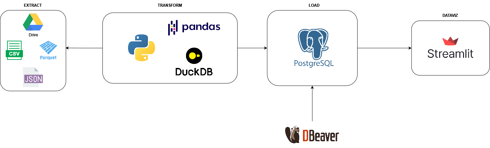

# DuckDb-ETL

# Pipeline de Engenharia de Dados Sem Custos

Este projeto tem como objetivo criar uma pipeline de engenharia de dados sem custos, utilizando ferramentas opensource e recursos gratuitos disponíveis na nuvem. A ideia é resolver problemas de engenharia de dados com o mínimo de investimento financeiro possível, tornando o projeto replicável e acessível a uma ampla gama de usuários.

# DuckDb no processo de ETL

DuckDB oferece vantagens significativas no processo de ETL devido ao seu desempenho otimizado para análise de dados, baixa latência em consultas, integração suave com Python e Pandas, facilidade de uso com sintaxe SQL familiar, e escalabilidade para lidar com grandes volumes de dados. Sua capacidade de processamento rápido e eficiente, juntamente com sua integração fácil, torna o DuckDB uma escolha valiosa para desenvolvedores e analistas envolvidos em projetos de ETL, permitindo um fluxo de trabalho suave e eficaz na transformação e carregamento de dados.

## Ferramentas Utilizadas

- **Python:** Linguagem de programação principal utilizada no projeto.
- **DuckDB:** Banco de dados em memória otimizado para análise de dados em Python.
- **Pandas:** Biblioteca Python para manipulação e análise de dados.
- **PostgreSQL:** Banco de dados relacional opensource utilizado para armazenamento de dados.
- **DBVear:** Ferramenta opensource para visualização e exploração de bancos de dados.
- **Streamlit:** Biblioteca Python para criação de aplicativos web interativos.
- **Render:** Serviço de hospedagem de aplicativos web, utilizado na camada gratuita para hospedar a aplicação Streamlit.

## Observações

- Para hospedar o projeto, é necessário criar uma conta gratuita no [Render](https://render.com/). Lá, você pode fazer o deploy em Docker da aplicação do Streamlit e subir um banco PostgreSQL.
- Neste projeto, realizamos a ingestão dos dados através de uma conta do Google Drive. Você pode inserir a sua conta ou utilizar outro data source, conforme necessário.
